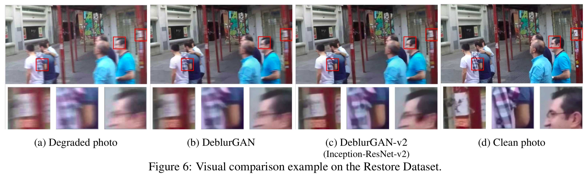
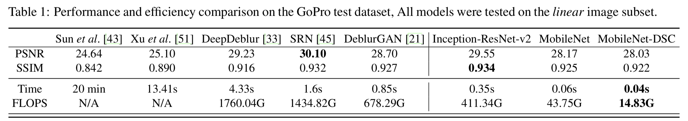
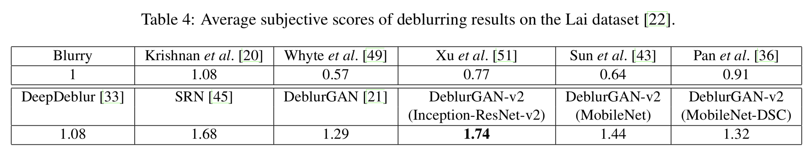

# GAN_DEBLUR: Deblurring Images

## Simply download `GAN_BLUR_REMOVAL.ipynb` and open it inside Kaggle or click [here](https://www.kaggle.com/code/rpjdev/gan-blur-removal) and copy the file with "File > Save a copy to Drive..." into your kaggle.

#### Important information

- If you can't open `GAN_BLUR_REMOVAL.ipynb` inside your kaggle, try this [colab link](https://www.kaggle.com/code/rpjdev/gan-blur-removal) and save it to your kaggle.

## Overview

We present a new end-to-end generative adversarial network (GAN) for single image motion deblurring, named 
GAN_DEBLUR, which considerably boosts state-of-the-art deblurring efficiency, quality, and flexibility. GAN_DEBLUR
is based on a relativistic conditional GAN with a double-scale discriminator. For the first time, we introduce the 
Feature Pyramid Network into deblurring, as a core building block in the generator of GAN_DEBLUR. It can flexibly 
work with a wide range of backbones, to navigate the balance between performance and efficiency. The plug-in of
sophisticated backbones (e.g., Inception-ResNet-v2) can lead to solid state-of-the-art deblurring. Meanwhile,
with light-weight backbones (e.g., MobileNet and its variants), GAN_DEBLUR reaches 10-100 times faster than
the nearest competitors, while maintaining close to state-of-the-art results, implying the option of real-time
video deblurring. We demonstrate that GAN_DEBLUR obtains very competitive performance on several popular
benchmarks, in terms of deblurring quality (both objective and subjective), as well as efficiency. Besides,
we show the architecture to be effective for general image restoration tasks too.

## GAN_DEBLUR Architecture

## Datasets

The datasets for training can be downloaded via the links below:
- [DVD](https://drive.google.com/file/d/1bpj9pCcZR_6-AHb5aNnev5lILQbH8GMZ/view)
- [GoPro](https://drive.google.com/file/d/1KStHiZn5TNm2mo3OLZLjnRvd0vVFCI0W/view)
- [NFS](https://drive.google.com/file/d/1Ut7qbQOrsTZCUJA_mJLptRMipD8sJzjy/view)

## Pre-trained models

<table align="center">
    <tr>
        <th>Dataset</th>
        <th>G Model</th>
        <th>D Model</th>
        <th>Loss Type</th>
        <th>PSNR/ SSIM</th>
        <th>Link</th>
    </tr>
    <tr>
        <td rowspan="3">GoPro Test Dataset</td>
        <td>InceptionResNet-v2</td>
        <td>double_gan</td>
        <td>ragan-ls</td>
        <td>29.55/ 0.934</td>
        <td><a href="https://drive.google.com/uc?export=view&id=1UXcsRVW-6KF23_TNzxw-xC0SzaMfXOaR">fpn_inception.h5</a></td>
    </tr>
    <tr>
        <td>MobileNet</td>
        <td>double_gan</td>
        <td>ragan-ls</td>
        <td>28.17/ 0.925</td>
        <td><a href="https://drive.google.com/uc?export=view&id=1JhnT4BBeKBBSLqTo6UsJ13HeBXevarrU">fpn_mobilenet.h5</a></td>
    </tr>
    <tr>
        <td>MobileNet-DSC</td>
        <td>double_gan</td>
        <td>ragan-ls</td>
        <td>28.03/ 0.922</td>
        <td></td>
    </tr>
</table>

